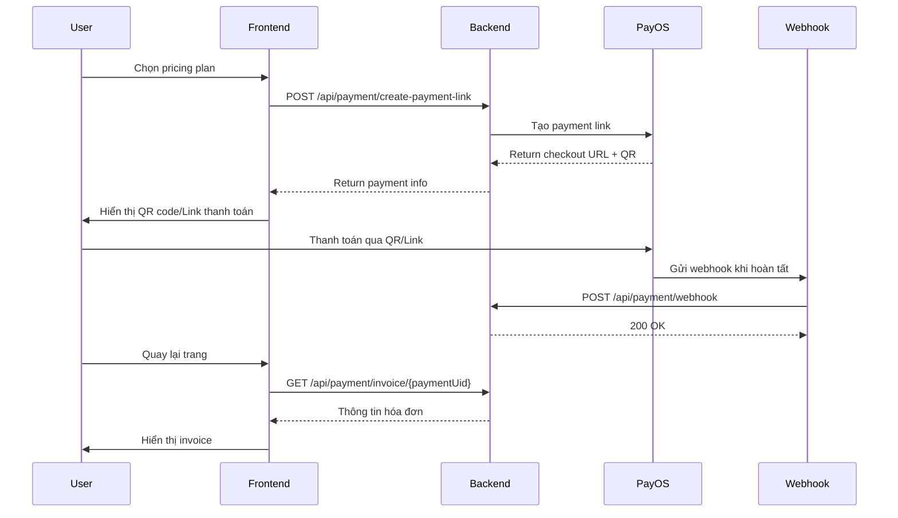

# Payment API Documentation

> **Tài liệu API tích hợp thanh toán PayOS**  
> Version: 1.0  
> Last Updated: November 5, 2025

## Mục lục
- [Tổng quan](#tổng-quan)
- [Luồng thanh toán](#luồng-thanh-toán)
- [API Endpoints](#api-endpoints)
- [Data Models](#data-models)
- [Xử lý lỗi](#xử-lý-lỗi)
- [Testing](#testing)

---

## Tổng quan

### Công nghệ sử dụng
- **Payment Gateway**: PayOS
- **Authentication**: JWT Bearer Token
- **Response Format**: JSON

### Base URL
```
Development: https://localhost:7168/api
Production: [TBD]
```

### Authentication
Tất cả API yêu cầu JWT token trong header:
```http
Authorization: Bearer {your_jwt_token}
```

---

## Luồng thanh toán



---

## API Endpoints

### 1. Tạo Payment Link

**Endpoint**: `POST /api/payment/create-payment-link`

**Description**: Tạo link thanh toán cho user mua pricing plan

**Request Body**:
```json
{
  "userUid": "U001",
  "planUid": "PLAN001",
  "returnUrl": "https://yoursite.com/payment/success",
  "cancelUrl": "https://yoursite.com/payment/cancel"
}
```

**Request Fields**:
| Field | Type | Required | Description |
|-------|------|----------|-------------|
| userUid | string | ✅ | UID của user mua gói |
| planUid | string | ✅ | UID của pricing plan |
| returnUrl | string | ✅ | URL redirect khi thanh toán thành công |
| cancelUrl | string | ✅ | URL redirect khi user hủy thanh toán |

**Response Success** (200):
```json
{
  "success": true,
  "message": "Payment link created successfully",
  "data": {
    "uid": "PAY-20241105-001",
    "checkoutUrl": "https://pay.payos.vn/web/...",
    "qrCode": "https://api.payos.vn/qr/...",
    "orderCode": 202411050001,
    "status": "PENDING",
    "amount": 299000,
    "description": "Thanh toán gói Premium Plan",
    "userName": "Nguyen Van A",
    "planName": "Premium Plan"
  }
}
```

**Response Fields**:
| Field | Type | Description |
|-------|------|-------------|
| uid | string | Payment UID để tracking |
| checkoutUrl | string | URL trang thanh toán PayOS |
| qrCode | string | URL QR code để quét thanh toán |
| orderCode | long | Mã đơn hàng (unique) |
| status | string | Trạng thái: PENDING, PAID, CANCELLED |
| amount | decimal | Số tiền cần thanh toán |
| description | string | Mô tả giao dịch |
| userName | string | Tên user |
| planName | string | Tên gói pricing |

**Response Error** (400):
```json
{
  "success": false,
  "message": "User not found"
}
```

**Response Error** (500):
```json
{
  "success": false,
  "message": "Failed to create payment link: [error details]"
}
```

---

### 2. Webhook từ PayOS

**Endpoint**: `POST /api/payment/webhook`

**Description**: Endpoint nhận webhook từ PayOS khi thanh toán hoàn tất (Backend tự xử lý, FE không cần gọi)

**Request Body** (từ PayOS):
```json
{
  "orderCode": 202411050001,
  "amount": 299000,
  "description": "Thanh toán gói Premium Plan",
  "accountNumber": "12345678",
  "reference": "FT123456789",
  "transactionDateTime": "2024-11-05T10:30:00",
  "currency": "VND",
  "paymentLinkId": "abc123",
  "code": "00",
  "desc": "Thành công",
  "counterAccountBankId": "970422",
  "counterAccountBankName": "MB Bank",
  "counterAccountName": "NGUYEN VAN A",
  "counterAccountNumber": "0123456789",
  "virtualAccountName": "PAYOS",
  "virtualAccountNumber": "9876543210"
}
```

**Response**: `200 OK`

---

### 3. Lấy thông tin hóa đơn

**Endpoint**: `GET /api/payment/invoice/{paymentUid}`

**Description**: Lấy thông tin chi tiết hóa đơn sau khi thanh toán

**Path Parameters**:
| Parameter | Type | Required | Description |
|-----------|------|----------|-------------|
| paymentUid | string | ✅ | Payment UID từ response create payment link |

**Response Success** (200):
```json
{
  "success": true,
  "data": {
    "paymentUid": "PAY-20241105-001",
    "invoiceNumber": "INV-FT123456789",
    "invoiceDate": "2024-11-05T10:30:00",
    
    "customerName": "Nguyen Van A",
    "customerEmail": "nguyenvana@example.com",
    "customerPhone": "",
    
    "orderUid": "ORD-001",
    "planName": "Premium Plan",
    "durationDays": 365,
    "serviceStartDate": "2024-11-05T00:00:00",
    "serviceEndDate": "2025-11-05T23:59:59",
    
    "paymentMethod": "QR",
    "transactionCode": "FT123456789",
    "amount": 299000,
    "currency": "VND",
    "status": "PAID",
    "paidAt": "2024-11-05T10:30:15",
    
    "organizationName": "CyberCity Learning",
    "organizationCode": ""
  }
}
```

**Response Fields**:
| Field | Type | Description |
|-------|------|-------------|
| **Payment Info** | | |
| paymentUid | string | UID của payment |
| invoiceNumber | string | Số hóa đơn (INV-{transactionCode}) |
| invoiceDate | datetime | Ngày tạo hóa đơn |
| status | string | PENDING / PAID / CANCELLED |
| paidAt | datetime? | Thời gian thanh toán (null nếu chưa thanh toán) |
| **Customer Info** | | |
| customerName | string | Tên khách hàng |
| customerEmail | string | Email khách hàng |
| customerPhone | string | SĐT (hiện tại empty) |
| **Order Info** | | |
| orderUid | string | UID đơn hàng |
| planName | string | Tên gói pricing |
| durationDays | int | Số ngày sử dụng |
| serviceStartDate | datetime? | Ngày bắt đầu dịch vụ |
| serviceEndDate | datetime? | Ngày kết thúc dịch vụ |
| amount | decimal | Số tiền |
| currency | string | Loại tiền tệ (VND) |
| **Payment Method** | | |
| paymentMethod | string | Phương thức thanh toán |
| transactionCode | string | Mã giao dịch từ PayOS |
| **Organization** | | |
| organizationName | string | Tên tổ chức (nếu có) |
| organizationCode | string | Mã tổ chức (hiện tại empty) |

**Response Error** (404):
```json
{
  "success": false,
  "message": "Payment with UID PAY-xxx not found"
}
```

**Response Error** (500):
```json
{
  "success": false,
  "message": "Failed to get payment invoice: [error details]"
}
```

---

### 4. Lấy lịch sử thanh toán

**Endpoint**: `GET /api/payment/history/{userUid}`

**Description**: Lấy danh sách lịch sử thanh toán của user

**Path Parameters**:
| Parameter | Type | Required | Description |
|-----------|------|----------|-------------|
| userUid | string | ✅ | UID của user |

**Response Success** (200):
```json
{
  "success": true,
  "data": [
    {
      "uid": "PAY-20241105-001",
      "orderId": "ORD-001",
      "amount": 299000,
      "currency": "VND",
      "paymentMethod": "QR",
      "status": "PAID",
      "description": "",
      "transactionId": "FT123456789",
      "createdAt": "2024-11-05T10:25:00",
      "completedAt": "2024-11-05T10:30:15"
    },
    {
      "uid": "PAY-20241001-002",
      "orderId": "ORD-002",
      "amount": 99000,
      "currency": "VND",
      "paymentMethod": "BANK_TRANSFER",
      "status": "PAID",
      "description": "",
      "transactionId": "FT987654321",
      "createdAt": "2024-10-01T14:20:00",
      "completedAt": "2024-10-01T14:25:30"
    }
  ]
}
```

**Response Fields**:
| Field | Type | Description |
|-------|------|-------------|
| uid | string | Payment UID |
| orderId | string | Order UID |
| amount | decimal | Số tiền |
| currency | string | Loại tiền tệ |
| paymentMethod | string | Phương thức thanh toán |
| status | string | Trạng thái thanh toán |
| description | string | Mô tả (hiện tại empty) |
| transactionId | string | Mã giao dịch |
| createdAt | datetime | Thời gian tạo payment |
| completedAt | datetime? | Thời gian hoàn tất (null nếu chưa thanh toán) |

**Sắp xếp**: Theo `createdAt` giảm dần (mới nhất trước)

**Response Error** (500):
```json
{
  "success": false,
  "message": "Failed to get payment history: [error details]"
}
```

---

### 5. Kiểm tra trạng thái thanh toán

**Endpoint**: `GET /api/payment/status/{paymentUid}`

**Description**: Kiểm tra trạng thái thanh toán hiện tại

**Path Parameters**:
| Parameter | Type | Required | Description |
|-----------|------|----------|-------------|
| paymentUid | string | ✅ | Payment UID |

**Response Success** (200):
```json
{
  "success": true,
  "data": {
    "uid": "PAY-20241105-001",
    "orderCode": 202411050001,
    "amountPaid": "299000",
    "status": "PAID",
    "paidAt": "2024-11-05T10:30:15",
    "cancellationReason": ""
  }
}
```

**Response Fields**:
| Field | Type | Description |
|-------|------|-------------|
| uid | string | Payment UID |
| orderCode | long | Mã đơn hàng |
| amountPaid | string | Số tiền đã thanh toán |
| status | string | PENDING / PAID / CANCELLED |
| paidAt | datetime? | Thời gian thanh toán |
| cancellationReason | string | Lý do hủy (nếu có) |

---

## Data Models

### Payment Status
```typescript
enum PaymentStatus {
  PENDING = "PENDING",      // Chờ thanh toán
  PAID = "PAID",           // Đã thanh toán
  CANCELLED = "CANCELLED"  // Đã hủy
}
```

### Payment Method
```typescript
enum PaymentMethod {
  QR = "QR",                    // Quét QR
  BANK_TRANSFER = "BANK_TRANSFER", // Chuyển khoản
  EWALLET = "EWALLET"          // Ví điện tử
}
```

---

## Xử lý lỗi

### Error Response Format
```json
{
  "success": false,
  "message": "Error description"
}
```

### Common Error Codes

| HTTP Code | Message | Ý nghĩa |
|-----------|---------|---------|
| 400 | User not found | Không tìm thấy user |
| 400 | Pricing plan not found | Không tìm thấy gói pricing |
| 401 | Unauthorized | Token không hợp lệ hoặc hết hạn |
| 404 | Payment not found | Không tìm thấy payment |
| 500 | Failed to create payment link | Lỗi tạo payment link |
| 500 | Failed to process webhook | Lỗi xử lý webhook |
| 500 | Failed to get payment invoice | Lỗi lấy hóa đơn |
| 500 | Failed to get payment history | Lỗi lấy lịch sử |

---

## Testing

### 1. Test Create Payment Link

**Request**:
```bash
curl -X POST https://localhost:7168/api/payment/create-payment-link \
  -H "Authorization: Bearer YOUR_JWT_TOKEN" \
  -H "Content-Type: application/json" \
  -d '{
    "userUid": "U001",
    "planUid": "PLAN001",
    "returnUrl": "https://yoursite.com/payment/success",
    "cancelUrl": "https://yoursite.com/payment/cancel"
  }'
```

**Expected**: Nhận được `checkoutUrl` và `qrCode`

---

### 2. Test Payment Flow

1. **Tạo payment link** → Nhận `paymentUid` và `checkoutUrl`
2. **Mở checkout URL** → Thanh toán qua PayOS
3. **Webhook tự động** → Backend nhận webhook và cập nhật status
4. **Kiểm tra status** → GET `/api/payment/status/{paymentUid}` → Status = "PAID"
5. **Lấy invoice** → GET `/api/payment/invoice/{paymentUid}` → Xem chi tiết hóa đơn

---

### 3. Test Payment History

**Request**:
```bash
curl -X GET https://localhost:7168/api/payment/history/U001 \
  -H "Authorization: Bearer YOUR_JWT_TOKEN"
```

**Expected**: Danh sách payments của user U001 theo thứ tự mới nhất

---

## Frontend Implementation Guide

### 1. Tạo Payment Link
```typescript
async function createPaymentLink(userUid: string, planUid: string) {
  const response = await fetch('/api/payment/create-payment-link', {
    method: 'POST',
    headers: {
      'Authorization': `Bearer ${token}`,
      'Content-Type': 'application/json'
    },
    body: JSON.stringify({
      userUid,
      planUid,
      returnUrl: window.location.origin + '/payment/success',
      cancelUrl: window.location.origin + '/payment/cancel'
    })
  });
  
  const result = await response.json();
  if (result.success) {
    // Hiển thị QR code hoặc redirect đến checkout URL
    showPaymentModal(result.data.qrCode, result.data.checkoutUrl);
    return result.data.uid; // Lưu paymentUid để check sau
  }
}
```

---

### 2. Hiển thị QR Code
```typescript
function showPaymentModal(qrCodeUrl: string, checkoutUrl: string) {
  // Option 1: Hiển thị QR code
  const qrImage = document.createElement('img');
  qrImage.src = qrCodeUrl;
  qrImage.alt = 'QR Code thanh toán';
  
  // Option 2: Link đến trang thanh toán
  const paymentLink = document.createElement('a');
  paymentLink.href = checkoutUrl;
  paymentLink.target = '_blank';
  paymentLink.textContent = 'Thanh toán ngay';
}
```

---

### 3. Polling Status (Kiểm tra định kỳ)
```typescript
async function pollPaymentStatus(paymentUid: string) {
  const interval = setInterval(async () => {
    const response = await fetch(`/api/payment/status/${paymentUid}`, {
      headers: { 'Authorization': `Bearer ${token}` }
    });
    
    const result = await response.json();
    if (result.success && result.data.status === 'PAID') {
      clearInterval(interval);
      // Thanh toán thành công
      showSuccessMessage();
      redirectToInvoice(paymentUid);
    } else if (result.data.status === 'CANCELLED') {
      clearInterval(interval);
      // Thanh toán bị hủy
      showCancelMessage();
    }
  }, 3000); // Check mỗi 3 giây
  
  // Timeout sau 5 phút
  setTimeout(() => clearInterval(interval), 300000);
}
```

---

### 4. Hiển thị Invoice
```typescript
async function showInvoice(paymentUid: string) {
  const response = await fetch(`/api/payment/invoice/${paymentUid}`, {
    headers: { 'Authorization': `Bearer ${token}` }
  });
  
  const result = await response.json();
  if (result.success) {
    const invoice = result.data;
    // Render invoice UI
    renderInvoiceTemplate(invoice);
  }
}

function renderInvoiceTemplate(invoice) {
  return `
    <div class="invoice">
      <h2>Hóa đơn ${invoice.invoiceNumber}</h2>
      <p>Ngày: ${new Date(invoice.invoiceDate).toLocaleDateString()}</p>
      
      <h3>Thông tin khách hàng</h3>
      <p>Tên: ${invoice.customerName}</p>
      <p>Email: ${invoice.customerEmail}</p>
      
      <h3>Thông tin gói dịch vụ</h3>
      <p>Gói: ${invoice.planName}</p>
      <p>Thời hạn: ${invoice.durationDays} ngày</p>
      <p>Từ: ${new Date(invoice.serviceStartDate).toLocaleDateString()}</p>
      <p>Đến: ${new Date(invoice.serviceEndDate).toLocaleDateString()}</p>
      
      <h3>Thanh toán</h3>
      <p>Số tiền: ${invoice.amount.toLocaleString()} ${invoice.currency}</p>
      <p>Phương thức: ${invoice.paymentMethod}</p>
      <p>Trạng thái: ${invoice.status}</p>
      <p>Mã giao dịch: ${invoice.transactionCode}</p>
    </div>
  `;
}
```

---

### 5. Hiển thị Payment History
```typescript
async function showPaymentHistory(userUid: string) {
  const response = await fetch(`/api/payment/history/${userUid}`, {
    headers: { 'Authorization': `Bearer ${token}` }
  });
  
  const result = await response.json();
  if (result.success) {
    renderPaymentHistory(result.data);
  }
}

function renderPaymentHistory(payments) {
  return payments.map(payment => `
    <div class="payment-item">
      <span>${new Date(payment.createdAt).toLocaleDateString()}</span>
      <span>${payment.amount.toLocaleString()} ${payment.currency}</span>
      <span class="status ${payment.status.toLowerCase()}">${payment.status}</span>
      <button onclick="showInvoice('${payment.uid}')">Xem hóa đơn</button>
    </div>
  `).join('');
}
```

---

## UI/UX Recommendations

### 1. Payment Flow
```
[Chọn gói] → [Xác nhận] → [QR Code/Link] → [Đợi thanh toán] → [Thành công] → [Invoice]
```

### 2. Loading States
- **Creating payment link**: "Đang tạo liên kết thanh toán..."
- **Waiting for payment**: "Đang chờ thanh toán... Vui lòng quét mã QR hoặc nhấn nút thanh toán"
- **Processing**: "Đang xử lý thanh toán..."
- **Success**: "Thanh toán thành công! ✓"

### 3. Error Handling
- **Network error**: "Lỗi kết nối. Vui lòng thử lại."
- **Payment failed**: "Thanh toán thất bại. Vui lòng liên hệ hỗ trợ."
- **Timeout**: "Hết thời gian chờ. Vui lòng tạo thanh toán mới."

### 4. Success Page
Sau khi thanh toán thành công, hiển thị:
- ✅ Thông báo thành công
- 📄 Nút "Xem hóa đơn"
- 🏠 Nút "Về trang chủ"
- 📧 "Hóa đơn đã được gửi qua email"

---

## Notes

### Quan trọng
1. **Webhook URL**: Backend cần expose endpoint `/api/payment/webhook` cho PayOS callback (cấu hình trong PayOS dashboard)
2. **CORS**: Đảm bảo backend cho phép origin của frontend
3. **Security**: 
   - JWT token phải được bảo mật
   - Validate user có quyền xem invoice/history
   - Webhook cần verify signature từ PayOS
4. **Testing**: Dùng PayOS test environment trước khi go live

### Limitations hiện tại
- `customerPhone`: Chưa có trong database User
- `organizationCode`: Chưa có trong database Organization  
- `description` trong PaymentHistory: Empty string

### Future Improvements
- Thêm filter theo status cho payment history
- Thêm pagination cho payment history
- Support refund
- Support payment reminder
- Export invoice PDF

---

## Contact & Support

Nếu có vấn đề hoặc câu hỏi:
- Backend Team: [Your contact]
- PayOS Documentation: https://payos.vn/docs
- Repository: CyberCityLearningFlatform_BE

---

**End of Documentation**
