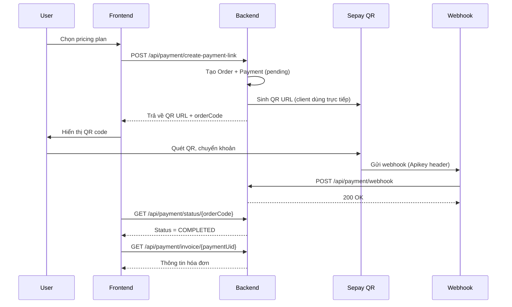

# Payment API Documentation

> **Tài liệu API thanh toán Sepay (QR Bank Transfer)**  
> Version: 2.0  
> Last Updated: November 10, 2025

## Mục lục
- [Tổng quan](#tổng-quan)
- [Luồng thanh toán](#luồng-thanh-toán)
- [API Endpoints](#api-endpoints)
- [Data Models](#data-models)
- [Xử lý lỗi](#xử-lý-lỗi)
- [Testing](#testing)

---

## Tổng quan

### Công nghệ sử dụng
- **Payment Gateway**: Sepay (QR động với tham số acc/bank/amount/des)
- **Authentication**: JWT Bearer Token (trừ webhook)
- **Response Format**: JSON

### Base URL
```
Development: https://localhost:7168/api
Production: [TBD]
```

### Authentication
Tất cả API yêu cầu JWT token trong header:
```http
Authorization: Bearer {your_jwt_token}
```

---

## Luồng thanh toán



---

## API Endpoints

### 1. Tạo Payment Link (QR Sepay)

**Endpoint**: `POST /api/payment/create-payment-link`

**Description**: Tạo Order + Payment (Status=pending) và sinh QR URL Sepay cho user mua pricing plan.

Sepay không hỗ trợ redirect nên không cần `returnUrl`, `cancelUrl`.

**Request Body**:
```json
{
  "userUid": "U001",
  "planUid": "PLAN001"
}
```

**Request Fields**:
| Field | Type | Required | Description |
|-------|------|----------|-------------|
| userUid | string | ✅ | UID của user mua gói |
| planUid | string | ✅ | UID của pricing plan |

**Response Success** (200):
```json
{
  "success": true,
  "message": "Tạo link thanh toán thành công",
  "data": {
    "uid": "PAYMENT_UID",
    "checkoutUrl": "https://qr.sepay.vn/img?acc=...&bank=MB&amount=299000&des=CYBERCITY-ORDxxxx-xxxxxxxx",
    "qrCode": "https://qr.sepay.vn/img?acc=...&bank=MB&amount=299000&des=CYBERCITY-ORDxxxx-xxxxxxxx",
    "orderCode": 559870123, 
    "status": "pending",
    "amount": 299000,
    "description": "Nguyen Van A_Premium Plan_365days",
    "userName": "Nguyen Van A",
    "planName": "Premium Plan"
  }
}
```

**Response Fields**:
| Field | Type | Description |
|-------|------|-------------|
| uid | string | Payment UID để tracking |
| checkoutUrl | string | QR URL Sepay (trùng qrCode) |
| qrCode | string | QR URL Sepay |
| orderCode | long | Mã đơn hàng (suy ra từ GUID, phục vụ tra cứu) |
| status | string | Trạng thái: pending/completed/cancelled/failed |
| amount | decimal | Số tiền cần thanh toán |
| description | string | Mô tả giao dịch |
| userName | string | Tên user |
| planName | string | Tên gói pricing |

**Response Error** (400):
```json
{
  "success": false,
  "message": "User not found"
}
```

**Response Error** (500):
```json
{
  "success": false,
  "message": "Failed to create payment link: [error details]"
}
```

---

### 2. Webhook từ Sepay

**Endpoint**: `POST /api/payment/webhook` (cũng chấp nhận `/api/payment/webhook/sepay`)

**Description**: Sepay gửi webhook khi người dùng chuyển khoản thành công. FE không gọi endpoint này.

**Authorization Header**:
```
Apikey {WebhookToken}
```
Hoặc `Authorization: Apikey {WebhookToken}`.

**Payload mẫu** (thực tế Sepay có thể thay đổi field; service chỉ cần `description`, `amount`, mã giao dịch):
```json
{
  "id": 123456,
  "amount": 299000,
  "description": "CYBERCITY-ORDabc12345-5f7e9d2a Premium Plan",
  "transaction_code": "TX123456789",
  "transferAmount": 299000,
  "content": "CYBERCITY-ORDabc12345-5f7e9d2a",
  "referenceCode": "TX123456789"
}
```

**Xử lý**:
1. Verify header Apikey token.
2. Trích `gatewayOrderCode` từ `description` theo pattern `CYBERCITY-ORD{...}-{GUID8}`.
3. Tìm `Payment` theo `TransactionCode` hoặc GUID suffix.
4. Nếu chưa completed → cập nhật `Status=completed`, `PaidAt=now` và `Order.PaymentStatus=paid`.

**Response**:
```json
{ "success": true, "message": "Webhook processed successfully" }
```
Hoặc 400 với `{ "success": false }`.

---

### 3. Lấy thông tin hóa đơn

**Endpoint**: `GET /api/payment/invoice/{paymentUid}`

**Description**: Lấy thông tin chi tiết hóa đơn sau khi thanh toán

**Path Parameters**:
| Parameter | Type | Required | Description |
|-----------|------|----------|-------------|
| paymentUid | string | ✅ | Payment UID từ response create payment link |

**Response Success** (200):
```json
{
  "success": true,
  "data": {
    "paymentUid": "PAY-20241105-001",
    "invoiceNumber": "INV-FT123456789",
    "invoiceDate": "2024-11-05T10:30:00",
    
    "customerName": "Nguyen Van A",
    "customerEmail": "nguyenvana@example.com",
    "customerPhone": "",
    
    "orderUid": "ORD-001",
    "planName": "Premium Plan",
    "durationDays": 365,
    "serviceStartDate": "2024-11-05T00:00:00",
    "serviceEndDate": "2025-11-05T23:59:59",
    
    "paymentMethod": "QR",
    "transactionCode": "FT123456789",
    "amount": 299000,
    "currency": "VND",
    "status": "PAID",
    "paidAt": "2024-11-05T10:30:15",
    
    "organizationName": "CyberCity Learning",
    "organizationCode": ""
  }
}
```

**Response Fields**:
| Field | Type | Description |
|-------|------|-------------|
| **Payment Info** | | |
| paymentUid | string | UID của payment |
| invoiceNumber | string | Số hóa đơn (INV-{transactionCode}) |
| invoiceDate | datetime | Ngày tạo hóa đơn |
| status | string | PENDING / PAID / CANCELLED |
| paidAt | datetime? | Thời gian thanh toán (null nếu chưa thanh toán) |
| **Customer Info** | | |
| customerName | string | Tên khách hàng |
| customerEmail | string | Email khách hàng |
| customerPhone | string | SĐT (hiện tại empty) |
| **Order Info** | | |
| orderUid | string | UID đơn hàng |
| planName | string | Tên gói pricing |
| durationDays | int | Số ngày sử dụng |
| serviceStartDate | datetime? | Ngày bắt đầu dịch vụ |
| serviceEndDate | datetime? | Ngày kết thúc dịch vụ |
| amount | decimal | Số tiền |
| currency | string | Loại tiền tệ (VND) |
| **Payment Method** | | |
| paymentMethod | string | Phương thức thanh toán |
| transactionCode | string | Mã giao dịch từ PayOS |
| **Organization** | | |
| organizationName | string | Tên tổ chức (nếu có) |
| organizationCode | string | Mã tổ chức (hiện tại empty) |

**Response Error** (404):
```json
{
  "success": false,
  "message": "Payment with UID PAY-xxx not found"
}
```

**Response Error** (500):
```json
{
  "success": false,
  "message": "Failed to get payment invoice: [error details]"
}
```

---

### 4. Lấy lịch sử thanh toán

**Endpoint**: `GET /api/payment/history/{userUid}`

**Description**: Lấy danh sách lịch sử thanh toán của user

**Path Parameters**:
| Parameter | Type | Required | Description |
|-----------|------|----------|-------------|
| userUid | string | ✅ | UID của user |

**Response Success** (200):
```json
{
  "success": true,
  "data": [
    {
      "uid": "PAY-20241105-001",
      "orderId": "ORD-001",
      "amount": 299000,
      "currency": "VND",
      "paymentMethod": "QR",
      "status": "PAID",
      "description": "",
      "transactionId": "FT123456789",
      "createdAt": "2024-11-05T10:25:00",
      "completedAt": "2024-11-05T10:30:15"
    },
    {
      "uid": "PAY-20241001-002",
      "orderId": "ORD-002",
      "amount": 99000,
      "currency": "VND",
      "paymentMethod": "BANK_TRANSFER",
      "status": "PAID",
      "description": "",
      "transactionId": "FT987654321",
      "createdAt": "2024-10-01T14:20:00",
      "completedAt": "2024-10-01T14:25:30"
    }
  ]
}
```

**Response Fields**:
| Field | Type | Description |
|-------|------|-------------|
| uid | string | Payment UID |
| orderId | string | Order UID |
| amount | decimal | Số tiền |
| currency | string | Loại tiền tệ |
| paymentMethod | string | Phương thức thanh toán |
| status | string | Trạng thái thanh toán |
| description | string | Mô tả (hiện tại empty) |
| transactionId | string | Mã giao dịch |
| createdAt | datetime | Thời gian tạo payment |
| completedAt | datetime? | Thời gian hoàn tất (null nếu chưa thanh toán) |

**Sắp xếp**: Theo `createdAt` giảm dần (mới nhất trước)

**Response Error** (500):
```json
{
  "success": false,
  "message": "Failed to get payment history: [error details]"
}
```

---

### 5. Kiểm tra trạng thái thanh toán

**Endpoint**: `GET /api/payment/status/{orderCode}`

**Description**: Kiểm tra trạng thái Payment bằng `orderCode` (số long suy từ GUID suffix).

**Response Success** (200):
```json
{
  "success": true,
  "data": {
    "orderCode": 559870123,
    "amount": 299000,
    "amountPaid": "299000",
    "amountRemaining": 0,
    "status": "COMPLETED",
    "createdAt": "2025-11-10T09:15:20",
    "canceledAt": null,
    "cancellationReason": null
  }
}
```

Lưu ý: `status` trả về từ service hiện dùng lowercase nội bộ (`pending`, `completed`, `cancelled`, `failed`) nhưng có thể được FE map sang hiển thị cho người dùng.

---

## Data Models

### Payment Status (Hiện tại trong DB)
```typescript
type PaymentStatus = "pending" | "completed" | "cancelled" | "failed";
// FE có thể map: completed -> PAID
```

### Payment Method
```typescript
type PaymentMethod = "SEPAY"; // Các phương thức khác chưa implement
```

---

## Xử lý lỗi

### Error Response Format
```json
{
  "success": false,
  "message": "Error description"
}
```

### Common Error Codes

| HTTP Code | Message | Ý nghĩa |
|-----------|---------|---------|
| 400 | User not found | Không tìm thấy user |
| 400 | Pricing plan not found | Không tìm thấy gói pricing |
| 401 | Unauthorized | Token không hợp lệ hoặc hết hạn |
| 404 | Payment not found | Không tìm thấy payment |
| 500 | Failed to create payment link | Lỗi tạo payment link |
| 500 | Failed to process webhook | Lỗi xử lý webhook |
| 500 | Failed to cancel payment link | Lỗi hủy thanh toán |
| 500 | Failed to get payment invoice | Lỗi lấy hóa đơn |
| 500 | Failed to get payment history | Lỗi lấy lịch sử |

---

## Testing

### 1. Test Create Payment Link (Sepay)

**Request**:
```bash
curl -X POST https://localhost:7168/api/payment/create-payment-link \
  -H "Authorization: Bearer YOUR_JWT_TOKEN" \
  -H "Content-Type: application/json" \
  -d '{
    "userUid": "U001",
    "planUid": "PLAN001"
  }'
```

**Expected**: Nhận được `checkoutUrl` và `qrCode`

---

### 2. Test Payment Flow (Sepay)

1. FE gọi create-payment-link → nhận `qrCode`, `orderCode`, `uid`.
2. Hiển thị QR cho user quét.
3. User chuyển khoản theo QR (nội dung mô tả chứa `CYBERCITY-ORD...`).
4. Sepay gửi webhook → backend cập nhật Payment + Order.
5. FE polling `GET /api/payment/status/{orderCode}` mỗi 3s tới khi `status=COMPLETED`.
6. Lấy invoice: `GET /api/payment/invoice/{paymentUid}`.

---

### 3. Test Payment History

**Request**:
```bash
curl -X GET https://localhost:7168/api/payment/history/U001 \
  -H "Authorization: Bearer YOUR_JWT_TOKEN"
```

**Expected**: Danh sách payments của user U001 theo thứ tự mới nhất

---

## Frontend Implementation Guide

### 1. Tạo Payment Link
```typescript
async function createPaymentLink(userUid: string, planUid: string) {
  const response = await fetch('/api/payment/create-payment-link', {
    method: 'POST',
    headers: {
      'Authorization': `Bearer ${token}`,
      'Content-Type': 'application/json'
    },
    body: JSON.stringify({ userUid, planUid })
  });
  const result = await response.json();
  if (result.success) {
    showPaymentModal(result.data.qrCode); // checkoutUrl == qrCode
    return { paymentUid: result.data.uid, orderCode: result.data.orderCode };
  }
}
```

---

### 2. Hiển thị QR Code
```typescript
function showPaymentModal(qrCodeUrl: string) {
  const qrImage = document.createElement('img');
  qrImage.src = qrCodeUrl;
  qrImage.alt = 'QR Code thanh toán Sepay';
  document.getElementById('qr-container')?.appendChild(qrImage);
}
```

---

### 3. Polling Status (Kiểm tra định kỳ)
```typescript
async function pollPaymentStatus(orderCode: number, paymentUid: string) {
  const interval = setInterval(async () => {
    const response = await fetch(`/api/payment/status/${orderCode}`, {
      headers: { 'Authorization': `Bearer ${token}` }
    });
    const result = await response.json();
    if (result.success && result.data.status === 'COMPLETED') {
      clearInterval(interval);
      showSuccessMessage();
      redirectToInvoice(paymentUid);
    } else if (result.data.status === 'CANCELLED' || result.data.status === 'FAILED') {
      clearInterval(interval);
      showCancelMessage();
    }
  }, 3000);
  setTimeout(() => clearInterval(interval), 300000);
}
```

---

### 4. Hiển thị Invoice
```typescript
async function showInvoice(paymentUid: string) {
  const response = await fetch(`/api/payment/invoice/${paymentUid}`, {
    headers: { 'Authorization': `Bearer ${token}` }
  });
  
  const result = await response.json();
  if (result.success) {
    const invoice = result.data;
    // Render invoice UI
    renderInvoiceTemplate(invoice);
  }
}

function renderInvoiceTemplate(invoice) {
  return `
    <div class="invoice">
      <h2>Hóa đơn ${invoice.invoiceNumber}</h2>
      <p>Ngày: ${new Date(invoice.invoiceDate).toLocaleDateString()}</p>
      
      <h3>Thông tin khách hàng</h3>
      <p>Tên: ${invoice.customerName}</p>
      <p>Email: ${invoice.customerEmail}</p>
      
      <h3>Thông tin gói dịch vụ</h3>
      <p>Gói: ${invoice.planName}</p>
      <p>Thời hạn: ${invoice.durationDays} ngày</p>
      <p>Từ: ${new Date(invoice.serviceStartDate).toLocaleDateString()}</p>
      <p>Đến: ${new Date(invoice.serviceEndDate).toLocaleDateString()}</p>
      
      <h3>Thanh toán</h3>
      <p>Số tiền: ${invoice.amount.toLocaleString()} ${invoice.currency}</p>
      <p>Phương thức: ${invoice.paymentMethod}</p>
      <p>Trạng thái: ${invoice.status}</p>
      <p>Mã giao dịch: ${invoice.transactionCode}</p>
    </div>
  `;
}
```

---

### 5. Hiển thị Payment History
```typescript
async function showPaymentHistory(userUid: string) {
  const response = await fetch(`/api/payment/history/${userUid}`, {
    headers: { 'Authorization': `Bearer ${token}` }
  });
  
  const result = await response.json();
  if (result.success) {
    renderPaymentHistory(result.data);
  }
}

function renderPaymentHistory(payments) {
  return payments.map(payment => `
    <div class="payment-item">
      <span>${new Date(payment.createdAt).toLocaleDateString()}</span>
      <span>${payment.amount.toLocaleString()} ${payment.currency}</span>
      <span class="status ${payment.status.toLowerCase()}">${payment.status}</span>
      <button onclick="showInvoice('${payment.uid}')">Xem hóa đơn</button>
    </div>
  `).join('');
}
```

---

## UI/UX Recommendations

### 1. Payment Flow
```
[Chọn gói] → [Xác nhận] → [QR Code/Link] → [Đợi thanh toán] → [Thành công] → [Invoice]
```

### 2. Loading States
- **Creating payment link**: "Đang tạo liên kết thanh toán..."
- **Waiting for payment**: "Đang chờ thanh toán... Vui lòng quét mã QR hoặc nhấn nút thanh toán"
- **Processing**: "Đang xử lý thanh toán..."
- **Success**: "Thanh toán thành công! ✓"

### 3. Error Handling
- **Network error**: "Lỗi kết nối. Vui lòng thử lại."
- **Payment failed**: "Thanh toán thất bại. Vui lòng liên hệ hỗ trợ."
- **Timeout**: "Hết thời gian chờ. Vui lòng tạo thanh toán mới."

### 4. Success Page
Sau khi thanh toán thành công, hiển thị:
- ✅ Thông báo thành công
- 📄 Nút "Xem hóa đơn"
- 🏠 Nút "Về trang chủ"
- 📧 "Hóa đơn đã được gửi qua email"

---

## Notes

### Quan trọng
1. **Webhook URL**: Backend cần expose endpoint `/api/payment/webhook` cho Sepay (cấu hình WebhookToken)
2. **CORS**: Đảm bảo backend cho phép origin của frontend
3. **Security**: 
  - JWT token bảo mật
  - Kiểm tra quyền truy cập invoice/history
  - Webhook kiểm tra đúng Apikey token
4. **Testing**: Dùng PayOS test environment trước khi go live

### Limitations hiện tại
- `customerPhone`: Chưa có trong database User
- `organizationCode`: Chưa có trong database Organization  
- `description` trong PaymentHistory: Empty string

### Future Improvements
- Thêm filter theo status cho payment history
- Thêm pagination cho payment history
- Support refund
- Support payment reminder
- Export invoice PDF

---

## Contact & Support

Nếu có vấn đề hoặc câu hỏi:
- Backend Team: [Your contact]
- Sepay Site: https://sepay.vn
- Repository: CyberCityLearningFlatform_BE

---

**End of Documentation (Sepay Version)**
